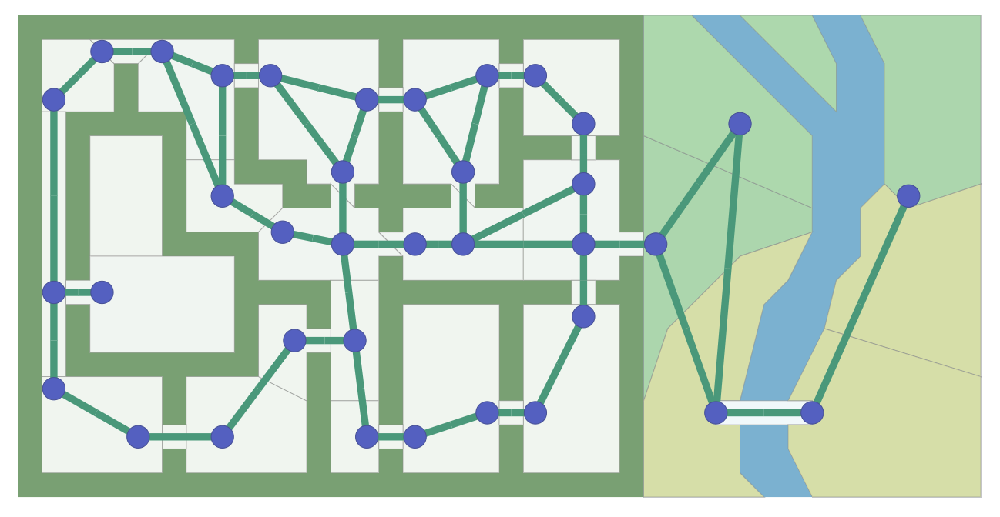

# A* 算法介绍

在游戏中，我们经常想找从一个位置到另一个位置的路径。我们不仅试图找到其中最短的路径，还希望考虑到时间成本。

要找到此路径，我们可以使用图搜索算法，该算法在将地图表示为图（Graph）这种数据结构时起作用。**A\***是其中一个非常流行的选择。**广度优先搜索（BFS）**是最简单的图搜索算法，因此，我们从它开始介绍，一步步深入到A\*算法。

## 地图表示法

研究算法时，要做的第一件事是理解**数据**。输入什么？输出是什么？

输入：包括 A* 在内的图搜索算法均以“图”作为输入。图是由一组位置（“节点”）和它们之间的连接（“边”）组成。下图为我为 A* 算法的输入：

A* 算法只看图的数据，看不到其他任何内容。它不知道某物是在室内还是室外，或者是房间还是门道，又或是面积有多大。它只能看到图！它不知道这张地图和另一张地图之间的区别。

输出：A* 找到的一条由图中节点以及边组成的路径。边是一个抽象的数学概念。A* 会告诉你从一个位置移动到另一个位置，但是不会告诉你如何移动过去。请记住，它对房间还是门一无所知；它能看到的所有信息只有图的数据。你必须决定由 A* 返回的边是指从一个图块单元（Tile）移动到另一个图块单元，还是走直线过去，或者打开一扇门，又或者沿着弯曲的路线游泳或奔跑过去。

权衡：对于任意给定的游戏地图，存在很多不同的方法创建出的寻路图给到 A* 进行计算。上面的地图使大多数门成为节点。如果我们将门口变成边怎么办？如果我们使用寻路网格怎么办？

